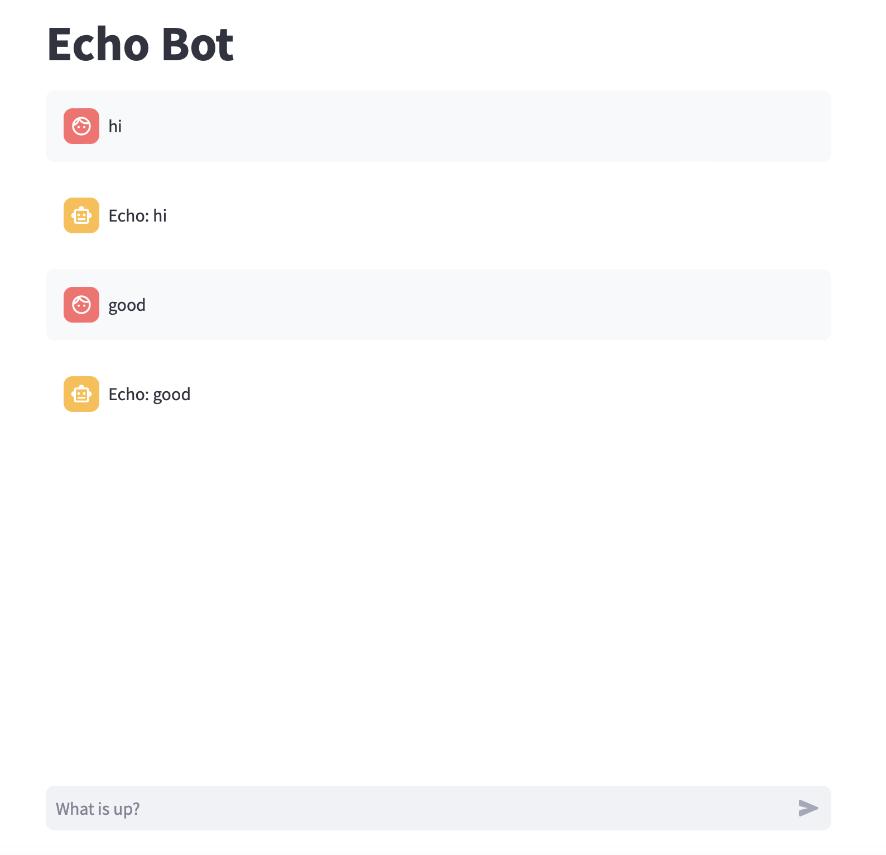
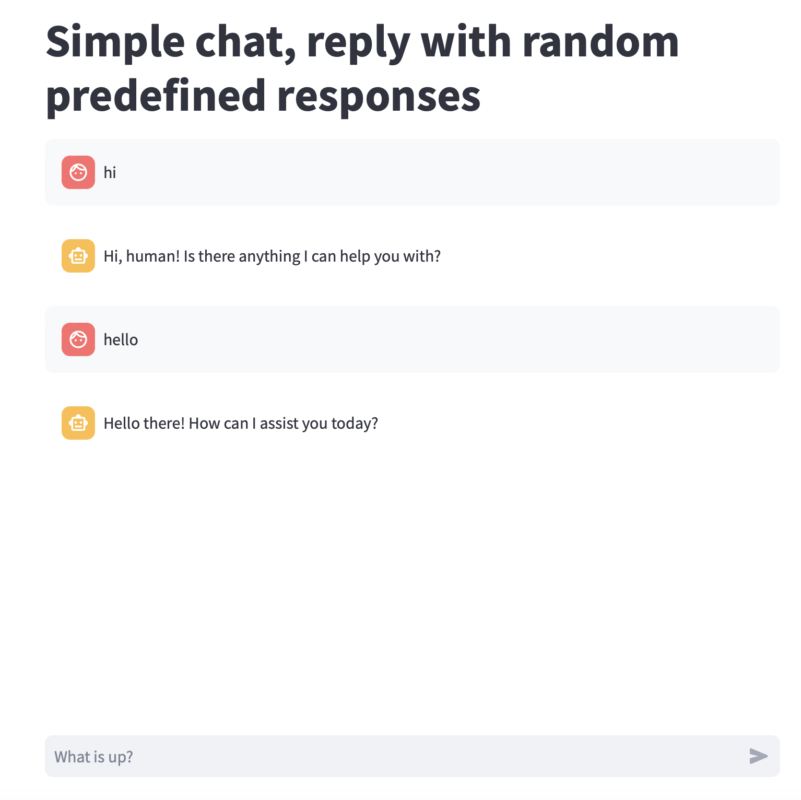
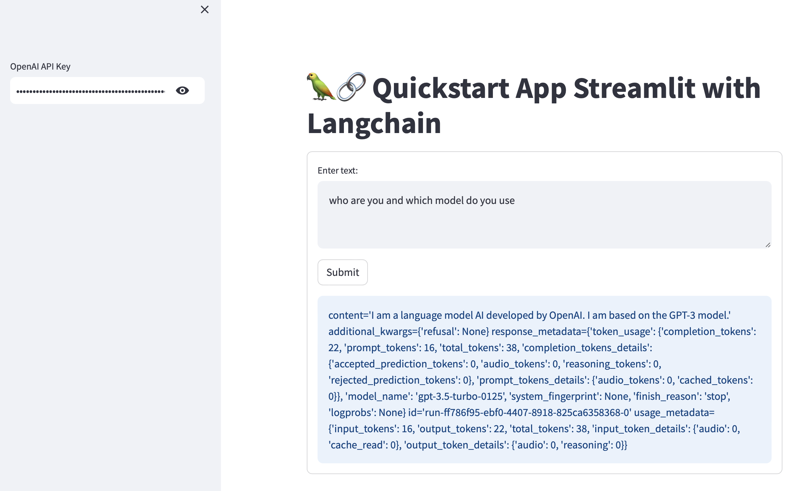
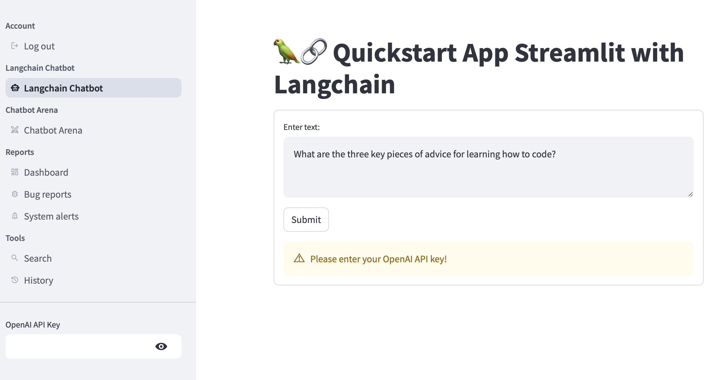
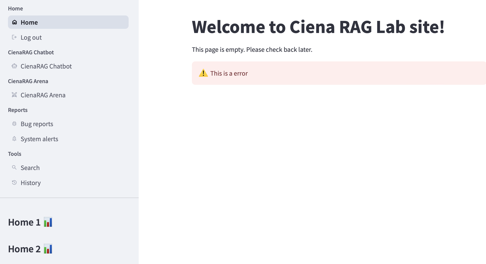

# Streamlit Chat App

## Setup venv

```linux
cd basic_llm_chatapp
python3 -m venv .venv
source .venv/bin/activate
(.venv) pip install -r requirements.txt
```

## Run Locally

```linux
(.venv)% streamlit run basic_chatbot.py

  You can now view your Streamlit app in your browser.

  Local URL: http://localhost:8501
  Network URL: http://192.168.0.4:8501
```

## Reference
1. For example 1-4: https://docs.streamlit.io/develop/tutorials/llms/build-conversational-apps 
2. For example 5: https://docs.streamlit.io/develop/tutorials/llms/llm-quickstart
3. Multi pages: https://docs.streamlit.io/get-started/fundamentals/additional-features
4. Multi pages: https://docs.streamlit.io/develop/concepts/multipage-apps


## Running screenshot

```
cd basic_llm_chatapp
streamlit run 3basic_chatbot.py
streamlit run 4basic_chatbot.py
streamlit run 5langchain_chatbot.py

rm -rf .venv # if have
python3 -m venv .venv
source .venv/bin/activate
pip install -r requirements.txt
streamlit run 6langchain_chatbot_multi_page_app/6main_multi_page_app.py
streamlit run 7ciena_rag_lab/ciena_rag_lab.py
```

### 3


### 4


### 5


### 6


### 7


